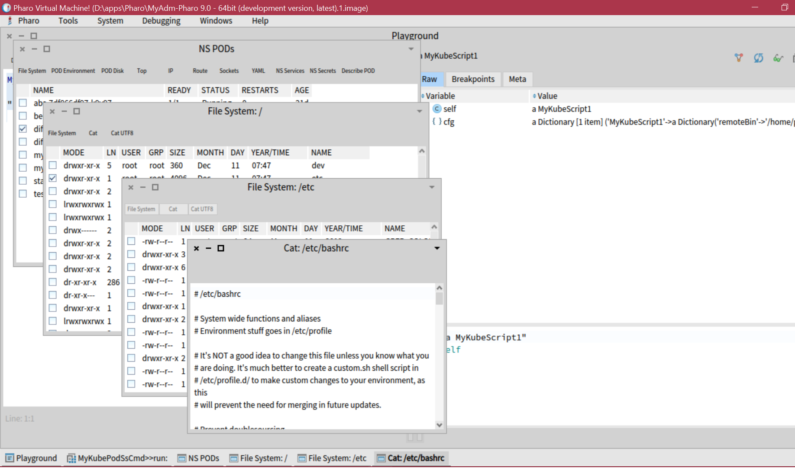

# MyAdm - Visual scripts for devops



## Usage

Open Playground and run some visual scripts set (all of them are successors of the `MyAbstractScript`):

```
MyWindowsScript1 new run.
```


or

```
MyKubeScript1 new run.
```

etc.

Also you need a configuration file for some of scripts with a name `MyAdm.cfg` which should be placed in the current working directory (where is Pharo.exe). It's just a plain JSON like and it can looks like:

```
{
  "MyKubeScript1": {
  	"sshAddr": "XX.XX.XX.XX",
  	"sshUser": "XXX",
  	"sshBin": "C:\\WINDOWS\\System32\\OpenSSH\\ssh.exe",
  	"remoteBin": "/home/XXX/bin"
  }
}
```

Interesting parameter here is a `remoteBin`. It is a folder on the remote system (where SSH will connect) where is located `kubectl` command, for example.

## UI

Toolbar buttons execute commands and open a new window with the command's output. If SHIFT key is pressed while the toolbar's button is clicking then the previous window will be closed.

## Features

Currently supported features are:

- browsing of PODs list
- browsing of POD's environment
- browsing of POD's disks volumes
- output of POD's processes command
- browsing of the IP/NICs list
- browsing of POD's routes table
- browsing of POD's sockets states
- browsing of POD's YAML file
- browsing of services list
- browsing of secrets with details, there plain contents, modification if them
- browsing of file system of the POD
- browsing of POD's files content, editing of them, downloading of them

## Work scenario

`MyKubeScript1` is a set of "visual scripts" or a scriptable/modifiable Kubernetes UI. It's easy to extend it, to add another commands. `MyKubeScript1` uses `MySshExec` executor and it was implemented for the scenario:

```
+---------------+               +--------------------------+  .----> POD
|               |               |       Linux machine      | '       ...
|  Windows box  +---<OpenSSH>---+           with           + ------> POD
|               |               |   <REMOTE-BIN>/kubectl   | \       ...
+---------------+               +--------------------------+  '----> POD
```

The prefect scenario for remote work!

## Installation

1. Install Pharo 9.
2. Clone this repository with Iceberg (into MyAdm package)
3. Install OpenSSH for Windows
4. Configure SSH so to be able to connect to the Linux machine without a password (set ssh-agent service to run manually and start it or to run automatically, generate pub/priv keys with ssh-keygen, put it to the authorized_keys on the Linux machine, add private key to the ssh-agent)
5. Open Playground in the Pharo
6. Write there `MyKubeScript1 new run.`
7. Do it with CTRL-D.

## Another scenario

To use local `kubectl`, change `MyKubeScript1` `run` method to use `MyShExec` or `MyPoshExec` executor (tbh, not tested completely).
